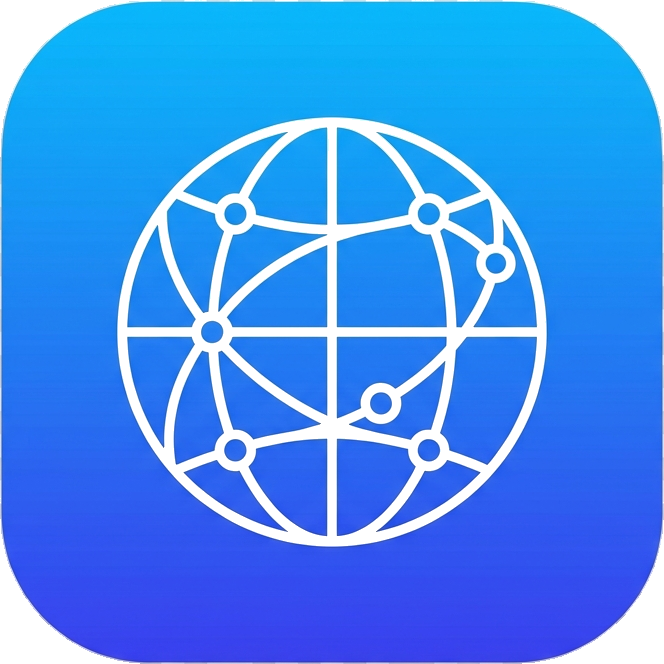

# DNS Switcher (Swift)

A sleek, native macOS menu bar status application built in Swift & SwiftUI to seamlessly switch Wi-Fi DNS server configurations between **Stream Mode** (SmartDNSProxy) and **Normal Mode** (Automatic DHCP).



## Key Features

- ⚡ **One-Click Mode Switching**: Instant toggle between SmartDNSProxy (`35.178.60.174`, `45.77.61.165`) and Automatic DHCP.
- 🎨 **Dynamic Action Buttons**: Clear color coding (Green for Stream, Blue for Normal/Automatic) with dynamic titles (`In Stream Mode` / `In Normal Mode` when active, bright active colors when clickable).
- 🔄 **Automatic Real-time Status Updates**: Automatically detects and refreshes iCloud Private Relay and DNS status changes when returning from System Settings without needing manual refresh.
- 🔒 **iCloud Private Relay Monitoring**: Automatically checks and displays iCloud Private Relay status (Active, Paused, Off).
- 🧹 **DNS Cache Flushing**: One-click flush for macOS `dscacheutil` and `mDNSResponder`.
- ⚙️ **Direct Preferences Link**: Interactive `Manage...` button to open macOS Internet Privacy settings for Private Relay toggles.
- 🎨 **Native macOS Menu Bar App**: Runs unobtrusively in the menu bar with dark/light mode support.

---

## Technical Design

For an in-depth look at the architecture, component hierarchy, privileged command handling, and build system, read the **[Technical Design Document](TECHNICAL_DESIGN.md)**.

---

## Building & Installing

### Requirements
- macOS 13.0 (Ventura) or later
- Swift 5.8+ / Swift 6.0+

### Build from Source
Run the included build script:
```bash
bash build_app.sh
```
This compiles the Swift source code, generates `AppIcon.icns`, assembles `DNS Switcher.app`, and installs it directly into `~/Applications/DNS Switcher.app`.

---

## Author & License

Created by **[ssray23](https://github.com/ssray23)**. Released under the MIT License.
