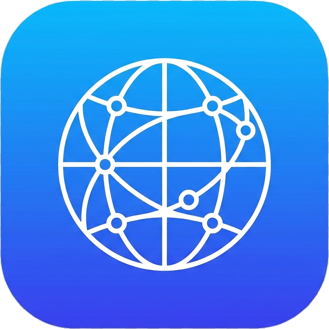

# DNS Switcher (Swift)

A sleek, native macOS menu bar status application built in Swift & SwiftUI to seamlessly switch Wi-Fi DNS server configurations between **Fast Browsing Mode** (Cloudflare, Google, Quad9), **Stream Mode** (SmartDNSProxy), and **Normal Mode** (Automatic DHCP).



## Key Features

- 🚀 **Fast Browsing Mode (High-Speed & Secure Presets)**:
  - ⚡ **Cloudflare** (`1.1.1.1` / `1.0.0.1`): Consistently ranks #1 in global speed tests with a strong focus on user privacy.
  - 🌐 **Google** (`8.8.8.8` / `8.8.4.4`): Highly stable and fast, though it logs query data for analytics.
  - 🛡️ **Quad9** (`9.9.9.9` / `149.112.112.112`): Balances fast response times with automated malware blocking.
- ⚡ **Stream Mode (SmartDNSProxy)**: Instant unblocking of global streaming services (Sony LIV, JioCinema, Hotstar, etc.).
- 🌐 **Normal Mode (Automatic DHCP)**: Reset to default router/DHCP network routing.
- 🌍 **Multi-City & European Server Settings**: Dedicated Settings page allowing selection of Primary and Secondary DNS servers across London, major European cities (Frankfurt, Paris, Amsterdam, Dublin, Madrid, Milan, Zurich, Copenhagen, Stockholm), North America, and Asia.
- ⚡ **Curated 2-Server Presets**: Quick one-click presets (e.g. `🇬🇧 London + 🇩🇪 Frankfurt`, `🇬🇧 London + 🇫🇷 Paris`, `🇳🇱 Amsterdam + 🇰🇷 Seoul`, `🇺🇸 US + 🇩🇰 Copenhagen`).
- 🏷️ **Provider & City-Aware DNS Badging**: Displays corresponding provider badges (Cloudflare ⚡, Google 🌐, Quad9 🛡️) and SmartDNS city/country flag badges next to active DNS IPs.
- ⚙️ **Smart State & Manual DNS Detection**: Accurately detects and distinguishes between Fast Browsing, Streaming Mode, Automatic (DHCP), and Manual/Custom DNS states.
- 🎨 **Dynamic Action Buttons**: Clear color coding (Purple for Fast Browsing, Green for Stream, Blue for Normal/Automatic) with dynamic titles and quick-selector pills.
- 🔄 **Automatic Real-time Status Updates**: Automatically detects and refreshes iCloud Private Relay and DNS status changes when returning from System Settings without needing manual refresh.
- 🔒 **iCloud Private Relay Monitoring**: Automatically checks and displays iCloud Private Relay status (Active, Paused, Off).
- 🧹 **DNS Cache Flushing**: One-click flush for macOS `dscacheutil` and `mDNSResponder`.
- ⚙️ **Direct Preferences Link**: Interactive `Manage...` button to open macOS Internet Privacy settings for Private Relay toggles.
- 🎨 **Native macOS Menu Bar App**: Runs unobtrusively in the menu bar with dark/light mode support.
- ⏱️ **Dual Benchmark Engine (DNS Ping & Streaming Route)**: 
  - **Fast Browsing Benchmark**: Measures raw DNS query round-trip latency (ms) concurrently via UDP probes on port 53.
  - **True Streaming Route Benchmark (TCP + TLS)**: Simulates actual proxy video paths by resolving a user-selected streaming domain (e.g., `hotstar.com` or `sonyliv.com`) and measuring the TCP connection latency (TTFB) directly to the Smart DNS proxy edge.
  - Displays color-coded latency badges (🟢 `< 35 ms`, 🟡 `35–80 ms`, 🔴 `> 80 ms`) next to every server to easily identify congested vs uncongested routes.
- ✨ **Auto-Select Fastest Server**: One-click automatic selection of the lowest-latency Fast DNS preset or SmartDNS Primary/Secondary pair — optimised for minimal buffering and fastest transition to 4K/highest resolution streaming.

---

## Understanding DNS

New to networking or want to learn how DNS works in simple terms? Read our beginner-friendly guide:
📖 **[How DNS Works — A Beginner's Guide](HOW_DNS_WORKS.md)**

---

## Technical Design

For an in-depth look at the architecture, component hierarchy, privileged command handling, and build system, read the **[Technical Design Document](TECHNICAL_DESIGN.md)**.

---

## Building & Installing

### Requirements
- macOS 13.0 (Ventura) or later
- Swift 5.8+ / Swift 6.0+

### Build from Source
Run the included build script:
```bash
bash build_app.sh
```
This compiles the Swift source code, generates `AppIcon.icns`, assembles `DNS Switcher.app`, and installs it directly into `~/Applications/DNS Switcher.app`.

---

## Author & License

Created by **[ssray23](https://github.com/ssray23)**. Released under the MIT License.
